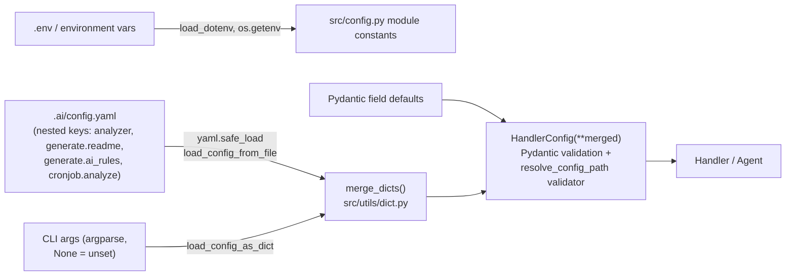
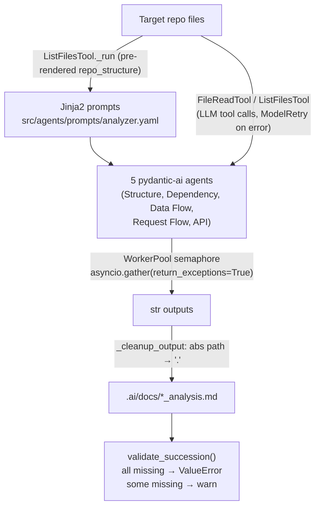
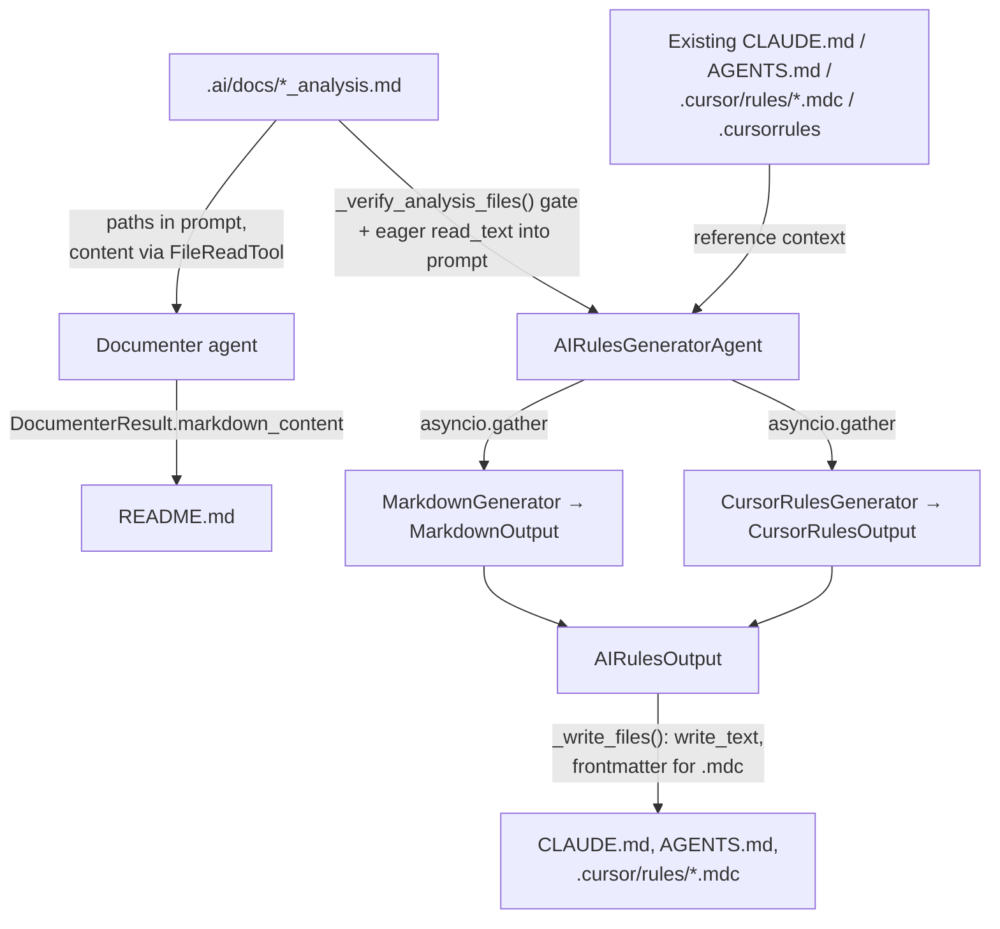
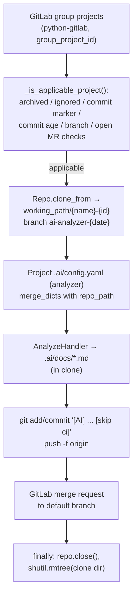

# Data Flow Analysis

## Data Models Overview

All data structures are Pydantic `BaseModel` classes. There is no database ORM; data lives in configuration objects, LLM output models, and files on disk.

### Configuration Models (input side)

| Model | File | Fields (key ones) | Purpose |
|---|---|---|---|
| `BaseHandlerConfig` | `src/handlers/base_handler.py` | `repo_path: Path`, `config: Optional[str]` | Base for all handler configs; validates `repo_path` exists and auto-resolves `.ai/config.yaml` / `.ai/config.yml` via `resolve_default_config_path()` |
| `AnalyzerAgentConfig` | `src/agents/analyzer.py` | `repo_path: Path`, `exclude_code_structure`, `exclude_data_flow`, `exclude_dependencies`, `exclude_request_flow`, `exclude_api_analysis` (all `bool`), `max_workers: int` | Controls which of the 5 analysis agents run |
| `AnalyzeHandlerConfig` | `src/handlers/analyze.py` | multiple inheritance of `BaseHandlerConfig` + `AnalyzerAgentConfig` | Config for `analyze` command |
| `ReadmeConfig` | `src/agents/documenter.py` | 10 `exclude_*` booleans + `use_existing_readme` | Controls README sections |
| `DocumenterAgentConfig` | `src/agents/documenter.py` | `repo_path: Path`, `readme: ReadmeConfig` (nested model) | Config for README generation |
| `ReadmeHandlerConfig` | `src/handlers/readme.py` | `BaseHandlerConfig` + `DocumenterAgentConfig` | Config for `generate readme` |
| `AIRulesGeneratorConfig` | `src/agents/ai_rules_generator.py` | `repo_path`, `skip_existing_claude_md/agents_md/cursor_rules: bool`, `detail_level: Literal["minimal","standard","comprehensive"]`, `max_claude_lines: int = 500`, `max_agents_lines: int = 150` | Config for AI rules generation |
| `AIRulesHandlerConfig` | `src/handlers/ai_rules.py` | `BaseHandlerConfig` + `AIRulesGeneratorConfig` | Config for `generate ai-rules` |
| `JobAnalyzeHandlerConfig` | `src/handlers/cronjob.py` | `max_days_since_last_commit: int = 30`, `working_path: Path = /tmp/cronjob/projects`, `group_project_id: int = 3` | Config for GitLab cronjob |

### LLM Structured Output Models (output side)

| Model | File | Fields | Consumer |
|---|---|---|---|
| `DocumenterResult` | `src/agents/documenter.py` | `markdown_content: str` | Written to `README.md` |
| `MarkdownOutput` | `src/agents/ai_rules_generator.py` | `claude_md: Optional[str]`, `agents_md: Optional[str]` | Written to `CLAUDE.md` / `AGENTS.md` |
| `CursorRule` | `src/agents/ai_rules_generator.py` | `filename`, `description`, `globs: list[str]`, `always_apply: bool`, `content` | One `.cursor/rules/*.mdc` file each |
| `CursorRulesOutput` | `src/agents/ai_rules_generator.py` | `cursor_rules: Optional[list[CursorRule]]` | Written by `_write_files()` |
| `AIRulesOutput` | `src/agents/ai_rules_generator.py` | union of `MarkdownOutput` + `CursorRulesOutput` fields | Aggregated result of both concurrent generators |

The 5 analysis agents in `src/agents/analyzer.py` use `output_type=str` (raw markdown, no structured model).

### Environment/Constants

`src/config.py` reads `.env` (via `python-dotenv`) at import time into module-level constants: `ANALYZER_LLM_*`, `DOCUMENTER_LLM_*`, `AI_RULES_LLM_*`, `GITLAB_*`, `HTTP_RETRY_*`, `TOOL_*_MAX_RETRIES`, `ENABLE_LANGFUSE`, etc. Required keys (`ANALYZER_LLM_MODEL/BASE_URL/API_KEY`, `DOCUMENTER_LLM_MODEL/BASE_URL/API_KEY`) fail fast with `KeyError` if missing.

## Data Transformation Map

### 1. Configuration pipeline (three-layer merge)

```
Pydantic defaults  →  .ai/config.yaml (nested key, e.g. "analyzer", "generate.readme", "generate.ai_rules", "cronjob.analyze")  →  CLI args (argparse, None = "not set")
```

- `src/main.py:parse_args()` auto-generates CLI flags from Pydantic `model_fields` (`_add_field_arg`); booleans use `store_true` with `default=None` so "unspecified" is distinguishable from `False`.
- `src/config.py:load_config_from_file()` — YAML file → dict, navigates dot-separated `file_key`, returns `{}` on missing file/key.
- `src/config.py:load_config_as_dict()` — argparse `Namespace` → dict shaped by the Pydantic model; recurses into nested `BaseModel` fields; converts `Path`-annotated values with `Path(arg_value)`.
- `src/utils/dict.py:merge_dicts(dict1, dict2)` — recursive deep merge, `dict2` (CLI) wins; mutates `dict1` in place.
- Final: `handler_config(**config)` instantiates and validates the merged dict.

### 2. Analysis pipeline (`analyze` command)

```
repo files → ListFilesTool/FileReadTool (strings) → LLM (pydantic-ai Agent, output_type=str) → _cleanup_output() → .ai/docs/*.md
```

- `src/agents/analyzer.py:_render_prompt()` injects `repo_path` and a pre-computed `repo_structure` (direct call to `ListFilesTool()._run(repo_path)`) into Jinja2 templates from `src/agents/prompts/analyzer.yaml`.
- Each agent's string output passes through `_cleanup_output()` (`src/agents/analyzer.py`): replaces the absolute `repo_path` with `"."` for portability, then is written to `.ai/docs/{structure|dependency|data_flow|request_flow|api}_analysis.md`.

### 3. README pipeline (`generate readme`)

```
.ai/docs/*.md (paths listed, content read by LLM via FileReadTool) → Documenter agent → DocumenterResult.markdown_content → README.md
```

- `src/agents/documenter.py:_render_prompt()` enumerates `.ai/docs/*.md` file paths into `available_ai_docs` and flattens `ReadmeConfig` via `model_dump()` into template vars; the LLM reads the docs itself with `FileReadTool`.

### 4. AI rules pipeline (`generate ai-rules`)

```
.ai/docs/*.md (read eagerly into prompt) + existing CLAUDE.md/AGENTS.md/.cursor rules → 2 concurrent agents → MarkdownOutput + CursorRulesOutput → AIRulesOutput → files
```

- `src/agents/ai_rules_generator.py:_read_analysis_files()` reads analysis docs into strings (required: `structure_analysis`, `dependency_analysis`, `data_flow_analysis` → `""` if missing with warning; optional: `request_flow_analysis`, `api_analysis` → `None` if missing) and embeds them directly in prompts.
- `_read_existing_files()` reads current `CLAUDE.md`, `AGENTS.md`, `.cursor/rules/*.mdc`, and legacy `.cursorrules` as reference context.
- `_write_files()` transforms each `CursorRule` into YAML frontmatter (`description`, `globs`, `alwaysApply`) + markdown body.

### 5. Cronjob pipeline (`cronjob analyze`)

```
GitLab API (group projects) → filter (_is_applicable_project) → git clone to working_path → AnalyzeHandler (pipeline 2) → git add/commit/push → GitLab MR → rmtree cleanup
```

- `src/handlers/cronjob.py:_analyze_project()` builds config by merging `{"repo_path": Path(repo.working_dir)}` with the cloned project's own `.ai/config.yaml` `analyzer` section via `merge_dicts` (project config wins), using a `SimpleNamespace` as a fake args object.

## Storage Interactions

No database. All persistence is filesystem and remote git.

| Location | Written by | Read by | Format |
|---|---|---|---|
| `.ai/docs/{structure,dependency,data_flow,request_flow,api}_analysis.md` (under target repo) | `src/agents/analyzer.py:_run_agent()` (`open(..., "w", encoding="utf-8")`, mkdir parents on demand) | `DocumenterAgent` (via LLM tool calls), `AIRulesGeneratorAgent._read_analysis_files()` (eager `read_text()`) | Markdown |
| `README.md` | `src/agents/documenter.py:_run_agent()` | LLM (optionally, if `use_existing_readme`) | Markdown |
| `CLAUDE.md`, `AGENTS.md` | `src/agents/ai_rules_generator.py:_write_files()` (`write_text`) | `_read_existing_files()` on subsequent runs | Markdown |
| `.cursor/rules/*.mdc` | `_write_files()` (frontmatter + content) | `_read_existing_files()` | YAML frontmatter + Markdown |
| `.ai/config.yaml` / `.yml` | user-authored | `src/config.py:load_config_from_file()`, `src/handlers/base_handler.py:resolve_default_config_path()` | YAML (`yaml.safe_load`) |
| `.env` | user-authored | `src/config.py` at import (`load_dotenv()`) | dotenv |
| `src/.logs/{repo_name}/{YYYY_MM_DD}/{timestamp}.log` | `src/utils/logger.py` FileHandler (configured in `src/main.py:configure_logging()`) | humans | text lines with ujson-serialized `data` |
| `/tmp/cronjob/projects/{name}-{id}` (configurable `working_path`) | `src/handlers/cronjob.py:_clone_project()` (`Repo.clone_from`) | analysis pipeline | git working tree; deleted in `_cleanup_project()` (`shutil.rmtree`, try/finally) |
| GitLab remote | `_create_merge_request()` (git add/commit/push -f, `project.mergerequests.create`) | `_is_applicable_project()` (branches, MRs, commits, archived flag) | GitLab REST via `python-gitlab` |
| `src/agents/prompts/*.yaml` | checked in | `src/utils/prompt_manager.py:PromptManager` | YAML of Jinja2 templates |

## Validation Mechanisms

- **Pydantic model validation** on every config instantiation (`load_config()` → `handler_config(**config)`): type coercion, `Path` conversion, `Literal` enforcement (`detail_level`).
- **`BaseHandlerConfig.resolve_config_path`** (`@model_validator(mode="after")`, `src/handlers/base_handler.py`): raises `ValueError` if `repo_path` does not exist; resolves default config path.
- **`AnalyzerAgent.__init__`** (`src/agents/analyzer.py`): raises `ValueError("All analysis options are excluded")` if all five exclusion flags are set.
- **`AnalyzerAgent.validate_succession()`**: post-run file-existence check over expected `.ai/docs/*.md`; all missing → raise `ValueError` (complete failure); some missing → log warning and continue (partial success).
- **`DocumenterAgent.validate_succession()`** (`src/agents/documenter.py`): raises `ValueError` if `README.md` missing (note: not invoked in `run()`).
- **`AIRulesGeneratorAgent._verify_analysis_files()`**: raises `ValueError` if `.ai/docs/` or any required analysis file is missing (forces `analyze` before `generate ai-rules`).
- **`AIRulesGeneratorAgent._write_files()`**: warns if `AGENTS.md` exceeds `max_agents_lines`.
- **Tool-level validation with retries** (`ModelRetry`, pydantic-ai): `src/agents/tools/file_tool/file_reader.py` raises `ModelRetry` for missing file, `PermissionError`, or any read failure (max retries `TOOL_FILE_READER_MAX_RETRIES=2`); LLM structured outputs are validated against `output_type` models with `retries=*_AGENT_RETRIES` (default 2).
- **HTTP response validation**: `src/utils/retry_client.py:should_retry_status()` raises `HTTPStatusError` on 502/503/504 to trigger tenacity retry (5 attempts, `Retry-After`-aware, exponential fallback, 60s/attempt, 300s total).
- **`src/config.py:str_to_bool()`**: raises `ValueError` on unrecognized boolean env strings.
- **Cronjob project gating** (`src/handlers/cronjob.py:_is_applicable_project()`): archived flag, ignored subgroups/IDs, last-commit message contains `COMMIT_MESSAGE_TITLE`, commit age vs `max_days_since_last_commit`, existing `ai-analyzer-{date}` branch, existing open MR by `GITLAB_USER_USERNAME`.

## State Management Analysis

- **Stateless between runs**: no cache, no DB; every invocation re-analyzes from scratch (documented limitation).
- **Process-level singletons**:
  - `Logger` (`src/utils/logger.py`): class-level `_logger`; `Logger.init()` is idempotent (warns on re-init). Structured `data` dicts are appended to messages as ujson.
  - Module constants in `src/config.py` loaded once at import.
- **Per-run objects**: handler configs, agents, and `PromptManager` are constructed per command execution. `PromptManager._template_cache` caches compiled Jinja2 `Template` objects keyed by template string (in-memory, per-instance).
- **Concurrency state**: `src/utils/worker_pool.py:WorkerPool` holds an `asyncio.Semaphore(max_workers)` (0 → `os.cpu_count()`); `run()` gathers with `return_exceptions=True` preserving input order, so exceptions are values in the results list (error isolation between the 5 analyzer agents). `AIRulesGeneratorAgent.run()` uses plain `asyncio.gather(*tasks, return_exceptions=True)` for its 2 generators but re-raises any exception.
- **Cronjob state**: sequential per-project loop; per-project clone directory is the only mutable state, removed in a `finally` block (`_cleanup_project`). Dedup/idempotency state lives in GitLab itself (branch names `ai-analyzer-{YYYY-MM-DD}`, commit message marker, open MRs).
- **Agent conversation state**: held internally by pydantic-ai per `agent.run()` call (`result.all_messages()` used only for logging counts).

## Serialization Processes

- **YAML deserialization**: `yaml.safe_load` for `.ai/config.yaml` (`src/config.py`) and prompt templates (`src/utils/prompt_manager.py`).
- **Jinja2 rendering**: prompt templates → strings with vars (`repo_path`, `repo_structure`, flattened `ReadmeConfig` via `model_dump()`, analysis file contents, skip flags).
- **Pydantic JSON schema / structured outputs**: pydantic-ai serializes `output_type` models (`DocumenterResult`, `MarkdownOutput`, `CursorRulesOutput`) as the LLM function/response schema and deserializes+validates LLM JSON back into model instances.
- **Cursor rule serialization**: `_write_files()` manually renders YAML frontmatter (`description`, `globs` list, `alwaysApply` lowercased bool) prepended to `rule.content`.
- **Log data**: `ujson.dumps` of the optional `data` dict in `src/utils/logger.py`.
- **Langfuse auth**: `base64.b64encode(f"{public}:{secret}")` into `OTEL_EXPORTER_OTLP_HEADERS` (`src/main.py:configure_langfuse()`); OpenTelemetry spans carry attributes such as full agent outputs (`span.set_attribute(f"{agent.name} result", ...)`), token usage, and repo version (`src/utils/repo.py:get_repo_version()` → `{branch}@{commit}` from `git rev-parse`).
- **File tool output framing**: `FileReadTool._run()` wraps content as `"File Line:{n} to {n+count} from: {total}\n--- start---\n...\n--- end ---\n"`; `ListFilesTool._run()` emits `"Files grouped by directory (relative to {dir}):"` with per-directory sorted file lists, filtering ~60 ignored dirs and ~90 ignored extensions (`DEFAULT_IGNORED_DIRS`, `DEFAULT_IGNORED_EXTENSIONS` in `src/agents/tools/dir_tool/list_files.py`).

## Data Lifecycle Diagrams

### Configuration data lifecycle



### Analyze command data lifecycle



### Generation data lifecycle (readme + ai-rules)



### Cronjob data lifecycle


