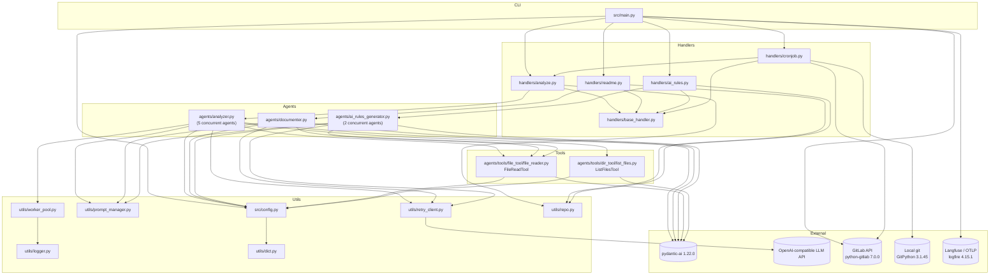

# Dependency Analysis

## Internal Dependencies Map

Top-level layering (dependencies point downward; `PYTHONPATH=src`, so imports are rooted at `config`, `handlers`, `agents`, `utils`):

- `src/main.py` (CLI entry point, `ai-doc-gen = "src.main:cli_main"` in `pyproject.toml`)
  - imports `config` / `config.load_config`
  - imports `handlers.analyze.AnalyzeHandler`, `handlers.readme.ReadmeHandler`, `handlers.ai_rules.AIRulesHandler`, `handlers.cronjob.JobAnalyzeHandler`
  - imports `utils.Logger`
  - constructs `gitlab.Gitlab` client and passes it into `JobAnalyzeHandler` (`src/main.py:95`)
  - configures observability via `logfire` + Langfuse env vars (`src/main.py:208-219`) and applies `nest_asyncio`

- `src/config.py` (module-level constants loaded from env at import time via `python-dotenv`)
  - imports `utils.dict.merge_dicts`
  - imported by: `src/main.py`, `src/agents/analyzer.py`, `src/agents/documenter.py`, `src/agents/ai_rules_generator.py`, `src/handlers/cronjob.py`, `src/agents/tools/file_tool/file_reader.py`, `src/agents/tools/dir_tool/list_files.py`

- `src/handlers/` (command orchestration layer)
  - `src/handlers/base_handler.py`: defines `AbstractHandler`, `BaseHandler`, `BaseHandlerConfig` (config-path resolution via `resolve_default_config_path`); depends only on `pydantic` and stdlib
  - `src/handlers/analyze.py` → `agents.analyzer.AnalyzerAgent`, `utils.Logger`, `utils.repo.get_repo_version`, `.base_handler`
  - `src/handlers/readme.py` → `agents.documenter.DocumenterAgent`, `utils`, `.base_handler`
  - `src/handlers/ai_rules.py` → `agents.ai_rules_generator.AIRulesGeneratorAgent`, `utils`, `.base_handler`
  - `src/handlers/cronjob.py` → `git.Repo` (GitPython), `gitlab` (python-gitlab), `config`, `handlers.analyze.AnalyzeHandler` (handler-to-handler reuse), `utils.dict.merge_dicts`, `.base_handler`

- `src/agents/` (LLM agent layer, all built on `pydantic_ai`)
  - `src/agents/analyzer.py` (`AnalyzerAgent`): builds 5 pydantic-ai `Agent` instances (structure, data-flow, dependency, request-flow, API analyzers at `src/agents/analyzer.py:213-297`), each registered with `FileReadTool` and `ListFilesTool`; runs them through `utils.WorkerPool` (`src/agents/analyzer.py:112`)
  - `src/agents/documenter.py` (`DocumenterAgent`): single agent, `FileReadTool` only
  - `src/agents/ai_rules_generator.py` (`AIRulesGeneratorAgent`): 2 concurrent agents (markdown + cursor rules) via `asyncio.gather` (`src/agents/ai_rules_generator.py:104`), `FileReadTool` only, structured output types (`MarkdownOutput`, `CursorRulesOutput`)
  - all three import `config`, `utils` (`Logger`, `PromptManager`, `create_retrying_client`), and `.tools`
  - prompts loaded from `src/agents/prompts/analyzer.yaml`, `src/agents/prompts/documenter.yaml`, `src/agents/prompts/ai_rules_generator.yaml` via `PromptManager`
  - `src/agents/__init__.py` re-exports `AnalyzerAgent` and `DocumenterAgent`

- `src/agents/tools/` (agent tool layer)
  - `src/agents/tools/__init__.py` re-exports `FileReadTool` (from `file_tool/file_reader.py`) and `ListFilesTool` (from `dir_tool/list_files.py`)
  - both tools depend on `pydantic_ai` (`Tool`, `ModelRetry`), `opentelemetry.trace`, `config`, `utils.Logger`

- `src/utils/` (shared utility layer; `src/utils/__init__.py` re-exports `merge_dicts`, `Logger`, `PromptManager`, `get_repo_version`, `create_retrying_client`, `WorkerPool`)
  - `src/utils/logger.py`: singleton logger, uses `ujson`
  - `src/utils/prompt_manager.py`: YAML + Jinja2 template loader with template cache
  - `src/utils/retry_client.py`: httpx `AsyncClient` factory with tenacity-based retry transport
  - `src/utils/repo.py`: git version string from `.git` metadata (stdlib only)
  - `src/utils/worker_pool.py`: asyncio worker pool; imports `from utils import Logger` (intra-package back-import, see Potential Dependency Issues)
  - `src/utils/dict.py`: `merge_dicts` (stdlib only)

## External Libraries Analysis

Declared in `pyproject.toml` (Python `>=3.13,<3.14`), resolved versions in `uv.lock`:

| Library | Version | Used in | Purpose |
|---|---|---|---|
| `pydantic` | 2.12.4 | `src/config.py`, all handlers and agents | Config/data model validation |
| `pydantic-ai` | 1.22.0 | `src/agents/*.py`, `src/agents/tools/*`, `src/utils/retry_client.py` | Agent framework: `Agent`, `Tool`, `ModelRetry`, `OpenAIChatModel`, `OpenAIProvider`, `ModelSettings`, `UnexpectedModelBehavior`, `AsyncTenacityTransport`, `wait_retry_after` |
| `jinja2` | 3.1.6 | `src/utils/prompt_manager.py` | Prompt template rendering |
| `pyyaml` | >=6.0.2 | `src/config.py`, `src/utils/prompt_manager.py` | Config and prompt YAML parsing |
| `ujson` | 5.11.0 | `src/utils/logger.py` | Fast JSON serialization for structured logs |
| `python-dotenv` | >=1.1.1 | `src/config.py` (`load_dotenv()` at import time) | `.env` loading |
| `python-gitlab` | 7.0.0 | `src/main.py`, `src/handlers/cronjob.py` | GitLab REST API client (projects, branches, MRs) |
| `gitpython` | 3.1.45 | `src/handlers/cronjob.py` (`Repo.clone_from`, commit, push) | Local git operations for cronjob mode |
| `logfire` | 4.15.1 | `src/main.py` | OpenTelemetry setup; instruments pydantic-ai and httpx (`send_to_logfire=False`, OTLP export to Langfuse) |
| `opentelemetry-instrumentation-httpx` | 0.58b0 | via `logfire.instrument_httpx` in `src/main.py` | HTTP-level tracing |
| `nest-asyncio` | 1.6.0 | `src/main.py` | Allows nested event loops |
| `httpx` | 0.28.1 (transitive) | `src/utils/retry_client.py` | Async HTTP client for LLM calls |
| `tenacity` | 9.1.2 (transitive) | `src/utils/retry_client.py` | Retry policies (`stop_after_attempt`, `wait_exponential`, `retry_if_exception_type`) |
| `opentelemetry-api` | 1.37.0 (transitive) | handlers, agents, tools (`from opentelemetry import trace`) | Manual span creation |

Dev-only (`[dependency-groups].dev` in `pyproject.toml`): `ruff >=0.14.0`, `ipython >=9.6.0`.

## Service Integrations

1. **LLM providers (OpenAI-compatible HTTP APIs)**
   - All three agents build `OpenAIChatModel` + `OpenAIProvider` with per-agent `base_url`/`api_key` from env: `ANALYZER_LLM_*`, `DOCUMENTER_LLM_*`, `AI_RULES_LLM_*` (AI-rules values fall back to documenter values, `src/config.py:53-55`).
   - Requests flow through the retrying `httpx.AsyncClient` from `src/utils/retry_client.py`, passed as `http_client` to `OpenAIProvider`.
   - Only the OpenAI-compatible path exists in this codebase (`src/agents/analyzer.py:194-196`, `src/agents/documenter.py:125`, `src/agents/ai_rules_generator.py:279-317`); there is no Gemini/custom provider module.

2. **GitLab** (`src/handlers/cronjob.py`, `src/main.py:95`)
   - `gitlab.Gitlab` client authenticated with `GITLAB_OAUTH_TOKEN` against `GITLAB_API_URL` (default `https://git.divar.cloud`).
   - Operations: project filtering (`_is_applicable_project`, `src/handlers/cronjob.py:75` — archived status, default-branch commit age, existing branches at line 109, open MRs at line 114), clone with OAuth token (`Repo.clone_from`, line 149), force-push analysis branch (line 191), create merge request (`project.mergerequests.create`, line 193), cleanup in `_cleanup_project` (line 213).

3. **Langfuse / OpenTelemetry** (`src/main.py:208-219`)
   - Optional (`ENABLE_LANGFUSE`); builds Basic-auth OTLP headers from `LANGFUSE_PUBLIC_KEY`/`LANGFUSE_SECRET_KEY`, exports via `OTEL_EXPORTER_OTLP_ENDPOINT`.
   - `logfire.instrument_pydantic_ai()` and `logfire.instrument_httpx(capture_all=True)` give automatic spans; handlers/tools add manual spans via `opentelemetry.trace`.

4. **Local filesystem / target git repository**
   - `FileReadTool` and `ListFilesTool` read the repository under analysis; outputs are written to `.ai/docs/*.md`, `README.md`, `CLAUDE.md`, `AGENTS.md`, and `.cursor/rules/*.mdc`.
   - `src/utils/repo.py` derives a `{branch}@{commit}` version string from `.git` metadata.

## Dependency Injection Patterns

- **Constructor injection of config objects**: every handler/agent receives a Pydantic config model (`AnalyzerAgentConfig`, `DocumenterAgentConfig`, `AIRulesGeneratorConfig`, `BaseHandlerConfig`, `JobAnalyzeHandlerConfig`) built by `config.load_config()`, which merges Pydantic defaults → `.ai/config.yaml` → CLI args via `utils.dict.merge_dicts`.
- **Client injection**: `JobAnalyzeHandler.__init__(gitlab_client: Gitlab, config: ...)` (`src/handlers/cronjob.py:45`) — the GitLab client is created in `src/main.py` and injected.
- **Factory functions**: `create_retrying_client()` (`src/utils/retry_client.py`) builds the HTTP client injected into each `OpenAIProvider`; per-agent `_llm_model()` methods act as model factories; tools are instantiated via `FileReadTool().get_tool()` / `ListFilesTool().get_tool()` and registered in `Agent(tools=[...])`.
- **No DI container**: wiring is explicit and manual. Module-level env constants in `src/config.py` are imported directly by agents and tools (service-locator style for settings).
- **Handler pattern**: `AbstractHandler.handle()` (`src/handlers/base_handler.py:51-53`) is the common command interface; `src/main.py` dispatches CLI subcommands to concrete handlers.

## Module Coupling Assessment

- **Low coupling, good cohesion overall**: `utils/` never imports `agents/` or `handlers/`; tools depend only on `config`, `utils`, and `pydantic_ai`; each generation handler depends on exactly one agent.
- **`src/config.py` is a global coupling point**: 7 modules import it directly, and it raises `KeyError` at import time if `ANALYZER_LLM_*`/`DOCUMENTER_LLM_*` env vars are missing — every module importing `config` transitively requires a fully configured environment.
- **Framework coupling**: `pydantic-ai` types permeate the agent and tool layers (models, providers, tools, retry transport). Replacing the framework would touch `src/agents/*`, `src/agents/tools/*`, and `src/utils/retry_client.py`.
- **Duplication instead of shared abstractions**: `_llm_model()` and `_run_agent()` are re-implemented in `src/agents/analyzer.py`, `src/agents/documenter.py`, and `src/agents/ai_rules_generator.py` with near-identical provider/settings construction.
- **Handler-to-handler dependency**: `src/handlers/cronjob.py:180` instantiates `AnalyzeHandler` directly, coupling batch mode to the analyze command implementation.
- **No circular dependencies across packages**; one fragile intra-package back-import exists (see below).

## Dependency Graph

## Potential Dependency Issues

1. **Unused retry configuration**: `src/config.py:88-91` defines `HTTP_RETRY_MAX_ATTEMPTS`, `HTTP_RETRY_MULTIPLIER`, `HTTP_RETRY_MAX_WAIT_PER_ATTEMPT`, `HTTP_RETRY_MAX_TOTAL_WAIT` (documented as tunable in `.env.sample`), but `src/utils/retry_client.py` hardcodes `stop_after_attempt(5)`, `wait_exponential(multiplier=1, max=60)`, and `max_wait=300` and never imports `config`. Changing these env vars has no effect.
2. **Import-time environment coupling**: `src/config.py` uses `os.environ[...]` for 6 required keys (`ANALYZER_LLM_MODEL/BASE_URL/API_KEY`, `DOCUMENTER_LLM_MODEL/BASE_URL/API_KEY`). Any import of `config` — including by the tools — fails hard without a complete `.env`, hindering testing and partial usage.
3. **Fragile intra-package back-import**: `src/utils/worker_pool.py:5` does `from utils import Logger` while `src/utils/__init__.py:6` imports `WorkerPool`. It works only because `Logger` is bound at `src/utils/__init__.py:2` before line 6 executes; reordering `__init__.py` would raise ImportError. It should import `from utils.logger import Logger` directly.
4. **Duplicated LLM wiring**: `_llm_model()` and `_run_agent()` are re-implemented in all three agent modules with near-identical `OpenAIChatModel`/`OpenAIProvider`/`ModelSettings` construction; timeouts and `parallel_tool_calls` are configured three separate times, inviting drift.
5. **Tight pin strategy plus internal-API usage**: runtime deps are exact-pinned (`pydantic==2.12.4`, `pydantic-ai==1.22.0`, etc.) except `pyyaml`/`python-dotenv` (`>=`). `src/utils/retry_client.py` depends on `pydantic_ai.retries` internals (`AsyncTenacityTransport`, `wait_retry_after`), so framework upgrades may break it.
6. **Cronjob → AnalyzeHandler coupling**: `src/handlers/cronjob.py:180` constructs `AnalyzeHandler(config=AnalyzeHandlerConfig(**final_config))` from a `SimpleNamespace`-merged config, bypassing the normal CLI config path; changes to `AnalyzeHandlerConfig` ripple into batch behavior.
7. **Docs/code mismatch**: `CLAUDE.md` and older `.ai/docs/` files reference a `utils/custom_models/` Gemini provider; no such module exists in `src/`. Only the OpenAI-compatible provider path is implemented.
