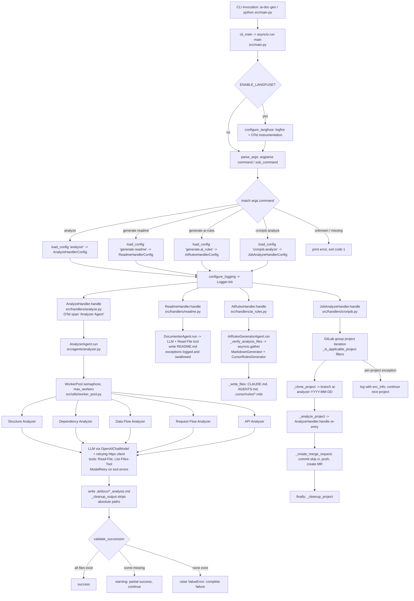

# Request Flow Analysis

## Entry Points Overview

This is a CLI application, not an HTTP server. "Requests" are CLI command invocations dispatched through a single entry point.

| Entry Point | Location | Description |
|---|---|---|
| `ai-doc-gen` console script | `pyproject.toml` (`[project.scripts] ai-doc-gen = "src.main:cli_main"`) | Installed CLI entry, calls `cli_main()` in `src/main.py` |
| `python src/main.py` | `src/main.py` (`if __name__ == "__main__": cli_main()`) | Direct script execution |
| Docker container | `Dockerfile` (`CMD ["uv", "run", "ai-doc-gen"]`) | Container default command |
| Kubernetes CronJob | `k8s/helm/templates/cronjob.yaml` (`.Values.cronjob.command` / `.Values.cronjob.args`) | Scheduled batch execution of the CLI |

Supported commands (subparsers built in `parse_args()` in `src/main.py`):

- `analyze` -> `analyze(args)` -> `AnalyzeHandler`
- `generate readme` -> `generate_readme(args)` -> `ReadmeHandler`
- `generate ai-rules` -> `generate_ai_rules(args)` -> `AIRulesHandler`
- `cronjob analyze` -> `cronjob_analyze(args)` -> `JobAnalyzeHandler`

`cli_main()` runs `asyncio.run(main())` and exits with the returned code via `sys.exit()`. `nest_asyncio.apply()` is called at module import to allow nested event loops.

## Request Routing Map

Routing is a two-level `argparse` dispatch in `src/main.py`:

1. `parse_args()` builds the parser. Handler CLI flags are auto-generated from Pydantic config model fields via `add_handler_args()` / `_add_field_arg()` (field `foo_bar` -> flag `--foo-bar`; booleans use `action="store_true"` with `default=None` to distinguish "not specified" from explicit `True`; nested `BaseModel` fields are flattened recursively).
2. `main()` dispatches on `args.command` with a `match` statement, then on `args.sub_command` for `generate` and `cronjob`. Unknown commands print an error and return exit code `1`. A missing command returns `1`.

Command-to-handler routing:

| Command | Async func (`src/main.py`) | Config model | Handler | Config file key |
|---|---|---|---|---|
| `analyze` | `analyze()` | `AnalyzeHandlerConfig` | `AnalyzeHandler` (`src/handlers/analyze.py`) | `analyzer` |
| `generate readme` | `generate_readme()` | `ReadmeHandlerConfig` | `ReadmeHandler` (`src/handlers/readme.py`) | `generate.readme` |
| `generate ai-rules` | `generate_ai_rules()` | `AIRulesHandlerConfig` | `AIRulesHandler` (`src/handlers/ai_rules.py`) | `generate.ai_rules` |
| `cronjob analyze` | `cronjob_analyze()` | `JobAnalyzeHandlerConfig` | `JobAnalyzeHandler` (`src/handlers/cronjob.py`) | `cronjob.analyze` |

All handlers implement `AbstractHandler.handle()` (`src/handlers/base_handler.py`). `AnalyzeHandlerConfig`, `ReadmeHandlerConfig`, and `AIRulesHandlerConfig` multiply-inherit from `BaseHandlerConfig` plus the corresponding agent config (`AnalyzerAgentConfig` in `src/agents/analyzer.py`, `DocumenterAgentConfig` in `src/agents/documenter.py`, `AIRulesGeneratorConfig` in `src/agents/ai_rules_generator.py`).

## Middleware Pipeline

There is no HTTP middleware. The equivalent preprocessing pipeline that every command passes through before its handler runs:

1. **Observability setup** (`main()` in `src/main.py`): if `config.ENABLE_LANGFUSE` is true, `configure_langfuse()` sets `OTEL_EXPORTER_OTLP_HEADERS` (Basic auth from `LANGFUSE_PUBLIC_KEY`/`LANGFUSE_SECRET_KEY`), configures `logfire` (`send_to_logfire=False`), and instruments pydantic-ai and httpx.
2. **Argument parsing** (`parse_args()`): `SystemExit` from argparse is caught in `main()` and returned as the exit code.
3. **Configuration merge** (`load_config()` in `src/config.py`): precedence is Pydantic model defaults < YAML file (`load_config_from_file()`, reads `{repo_path}/.ai/config.yaml` or the `--config` path, extracts the nested `file_key`) < CLI args (`load_config_as_dict()`, only non-`None` values). Merged via `merge_dicts()` (`src/utils/dict.py`) and validated by instantiating the Pydantic model. A missing config file or key yields `{}` (graceful).
4. **Config validation** (`BaseHandlerConfig.resolve_config_path` model validator in `src/handlers/base_handler.py`): raises `ValueError` if `repo_path` does not exist; auto-resolves `config` to `.ai/config.yaml` / `.ai/config.yml` via `resolve_default_config_path()`.
5. **Logging init** (`configure_logging()` in `src/main.py`): initializes the singleton `Logger` (`src/utils/logger.py`), writing to `src/.logs/{repo_name}/{YYYY_MM_DD}/` with separate file and console levels (`FILE_LOG_LEVEL`, `CONSOLE_LOG_LEVEL` from `src/config.py`).
6. **Tracing span** (each handler's `handle()`): opens an OpenTelemetry span (`"Analyzer Agent"`, `"Readme Handler"`, `"AI Rules Handler"`) with attributes such as `repo_path`, `repo_version` (from `get_repo_version()` in `src/utils/repo.py`), and config flags.

At the outbound (LLM HTTP) layer, `create_retrying_client()` (`src/utils/retry_client.py`) acts as transport middleware: `AsyncTenacityTransport` retries on `HTTPStatusError`/`ConnectionError` (429 via `wait_retry_after`; 502/503/504 via `should_retry_status` calling `raise_for_status`), respects `Retry-After` headers, falls back to exponential backoff (multiplier 1, max 60s per attempt, 300s total), stops after 5 attempts, then re-raises.

## Controller/Handler Analysis

Handlers are thin controllers (`src/handlers/`) that construct and delegate to agents (`src/agents/`):

- **`AnalyzeHandler`** (`src/handlers/analyze.py`): wraps `AnalyzerAgent` (`src/agents/analyzer.py`). `AnalyzerAgent.run()` builds up to 5 agent tasks (Structure Analyzer, Dependency Analyzer, Data Flow Analyzer, Request Flow Analyzer, API Analyzer), each gated by an `exclude_*` config flag (the constructor raises `ValueError` if all five are excluded). Tasks run through `WorkerPool` (`src/utils/worker_pool.py`): an `asyncio.Semaphore(max_workers)` (0 = CPU count) wrapping `asyncio.gather(..., return_exceptions=True)`. Each task (`_run_agent`) runs a pydantic-ai `Agent` (OpenAI-compatible `OpenAIChatModel`, `retries=config.ANALYZER_AGENT_RETRIES`, tools `FileReadTool` + `ListFilesTool`, system/user prompts rendered by `PromptManager` from `src/agents/prompts/analyzer.yaml`) and writes output to `{repo_path}/.ai/docs/{name}_analysis.md` after `_cleanup_output()` replaces the absolute repo path with `.`.
- **`ReadmeHandler`** (`src/handlers/readme.py`): wraps `DocumenterAgent` (`src/agents/documenter.py`). A single agent with `FileReadTool`, structured output `DocumenterResult`, prompt rendered with the list of existing `.ai/docs/*.md` files and `ReadmeConfig` exclusion flags; writes `{repo_path}/README.md`.
- **`AIRulesHandler`** (`src/handlers/ai_rules.py`): wraps `AIRulesGeneratorAgent` (`src/agents/ai_rules_generator.py`). `run()` first calls `_verify_analysis_files()` (raises `ValueError` if `.ai/docs/` or the required `structure_analysis.md`, `dependency_analysis.md`, `data_flow_analysis.md` are missing), computes skip flags (`_check_skip_files()`) and existing file contents (`_read_existing_files()`), then runs up to 2 concurrent tasks via `asyncio.gather(..., return_exceptions=True)`: `MarkdownGenerator` (structured `MarkdownOutput` -> CLAUDE.md and AGENTS.md) and `CursorRulesGenerator` (structured `CursorRulesOutput` -> `.cursor/rules/*.mdc`). `_write_files()` persists results, adding YAML frontmatter to each `.mdc` rule and warning if AGENTS.md exceeds `max_agents_lines`.
- **`JobAnalyzeHandler`** (`src/handlers/cronjob.py`): batch controller. Iterates GitLab group projects (`git_group.projects.list(iterator=True, include_subgroups=True)` for `group_project_id`), filters with `_is_applicable_project()` (skips archived projects, `IGNORED_SUBGROUPS`/`IGNORED_PROJECTS`, projects whose last commit message contains `COMMIT_MESSAGE_TITLE`, projects staler than `max_days_since_last_commit`, existing `ai-analyzer-{YYYY-MM-DD}` branch, existing open MR by `GITLAB_USER_USERNAME`). For each applicable project, `_handle_project()` executes: `_clone_project()` (clone into `working_path`, set git identity, checkout new branch) -> `_analyze_project()` (re-enters `AnalyzeHandler.handle()` with per-project `.ai/config.yaml` merged over base config via `merge_dicts`) -> `_create_merge_request()` (commit `[AI] Analyzer-Agent: Create/Update AI Analysis [skip ci]`, force-push, create MR) -> `_cleanup_project()` in a `finally` block.

Tool sub-handlers invoked by LLM tool calls (registered via `Tool(...)` in `src/agents/tools/`):

- `FileReadTool._run()` (`src/agents/tools/file_tool/file_reader.py`): tool name `Read-File`; reads a file with `line_number`/`line_count` parameters (default 200 lines); raises `ModelRetry` on missing file, `PermissionError`, or any read failure; `max_retries=config.TOOL_FILE_READER_MAX_RETRIES` (default 2).
- `ListFilesTool._run()` (`src/agents/tools/dir_tool/list_files.py`): tool name `List-Files-Tool`; recursive `os.walk` listing grouped by directory, filtering `DEFAULT_IGNORED_DIRS` and `DEFAULT_IGNORED_EXTENSIONS`; `max_retries=config.TOOL_LIST_FILES_MAX_RETRIES` (default 2). Also called directly (non-LLM) in `AnalyzerAgent._render_prompt()` to embed the repo structure into prompts.

## Authentication & Authorization Flow

No user-facing authentication or authorization exists (local CLI tool). Credentials are outbound only, loaded from environment variables in `src/config.py` (`load_dotenv()` at import):

- **LLM APIs**: `ANALYZER_LLM_API_KEY`, `DOCUMENTER_LLM_API_KEY`, `AI_RULES_LLM_API_KEY` (falls back to documenter values) passed as `api_key` to `OpenAIProvider` in `src/agents/analyzer.py`, `src/agents/documenter.py`, and `src/agents/ai_rules_generator.py`.
- **GitLab**: `GITLAB_OAUTH_TOKEN` used in `cronjob_analyze()` (`src/main.py`) to build `Gitlab(url=config.GITLAB_API_URL, oauth_token=...)`; git identity from `GITLAB_USER_NAME`/`GITLAB_USER_EMAIL` set in `JobAnalyzeHandler._clone_project()`; `GITLAB_USER_USERNAME` used to detect existing MRs authored by the bot.
- **Langfuse**: `LANGFUSE_PUBLIC_KEY`/`LANGFUSE_SECRET_KEY` Base64-encoded into `OTEL_EXPORTER_OTLP_HEADERS` in `configure_langfuse()` (`src/main.py`).

Missing required env vars (`ANALYZER_LLM_MODEL`, `ANALYZER_LLM_BASE_URL`, `ANALYZER_LLM_API_KEY`, `DOCUMENTER_LLM_MODEL`, `DOCUMENTER_LLM_BASE_URL`, `DOCUMENTER_LLM_API_KEY`) raise `KeyError` at import of `src/config.py`, failing fast before any command runs.

## Error Handling Pathways

Layered, isolation-first error handling:

- **CLI layer** (`src/main.py`): argparse `SystemExit` caught in `main()` and returned as exit code; unknown/missing commands print an error and return `1`; `cli_main()` maps non-`None` return values to `sys.exit()`.
- **Config layer** (`src/config.py`, `src/handlers/base_handler.py`): Pydantic `ValidationError` on bad values; explicit `ValueError` for a nonexistent `repo_path`; missing YAML config file or missing `file_key` degrades to `{}`.
- **Analyzer fan-out** (`src/agents/analyzer.py`): `WorkerPool.run()` uses `asyncio.gather(return_exceptions=True)`, so one agent's failure never cancels the others. Per-agent exceptions are logged with `Logger.error(..., exc_info=True)`. `validate_succession()` then checks the output files: all present = success; some missing = warning logged, execution continues (partial success); all missing = `raise ValueError("Complete analysis failure: no analysis files were generated")`.
- **Agent level**: pydantic-ai `retries=config.*_AGENT_RETRIES` (default 2); tools raise `ModelRetry` (file not found / permission denied / read failure) to trigger tool-call retries up to each tool's `max_retries` (default 2). `AnalyzerAgent._run_agent()` catches `UnexpectedModelBehavior` separately, logs, and re-raises.
- **HTTP level** (`src/utils/retry_client.py`): tenacity-based retries (5 attempts, `Retry-After`-aware, exponential backoff, 300s total cap) with `reraise=True` on exhaustion.
- **Documenter** (`src/agents/documenter.py` `_run_agent()`): catches all exceptions and only logs them (`Logger.info(f"Error running agent: {e}")`) — errors are swallowed and README.md may silently not be written; `validate_succession()` exists but is never called in `run()`.
- **AI Rules** (`src/agents/ai_rules_generator.py`): `asyncio.gather(return_exceptions=True)`, but any captured exception is logged and re-raised in `run()` (fail-fast, unlike the analyzer); pre-flight `_verify_analysis_files()` raises `ValueError` with a remediation message ("Please run 'analyze' command first").
- **Cronjob** (`src/handlers/cronjob.py`): per-project try/except in `handle()` logs errors with `exc_info=True` and continues with the next project (batch isolation); `_handle_project()` guarantees `_cleanup_project()` via try/finally.

Status-code equivalents are process exit codes: `0` (implicit) on success, `1` for routing errors, argparse exit codes passed through, and uncaught exceptions propagating out of `asyncio.run()` as a nonzero exit.

## Request Lifecycle Diagram

