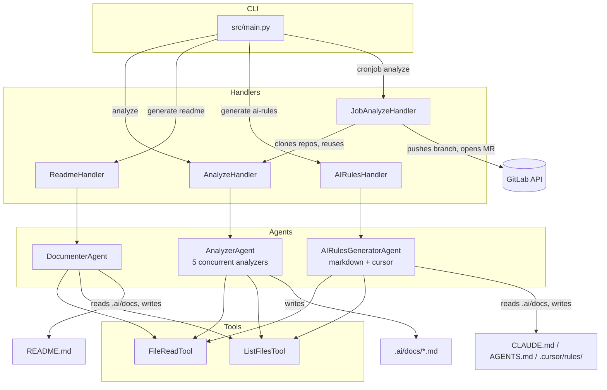
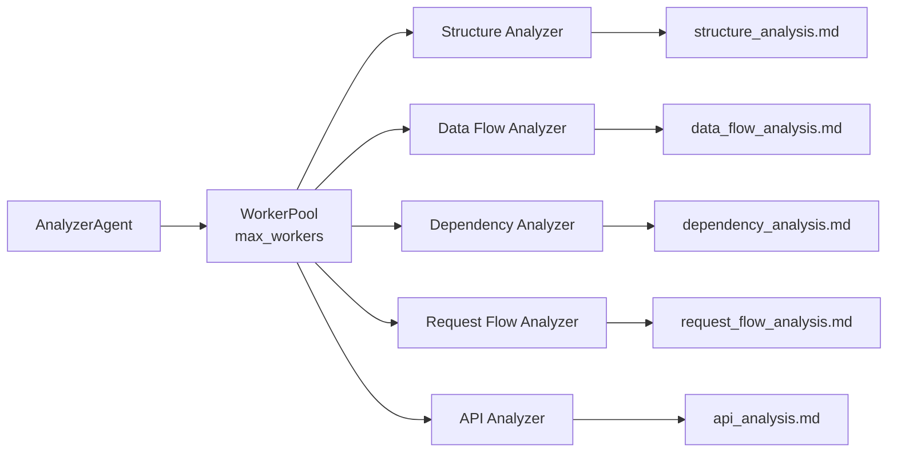

# AI Documentation Generator

An AI-powered code documentation generator that automatically analyzes repositories and creates comprehensive documentation using large language models. The system employs a multi-agent architecture: five specialized analysis agents run concurrently to map a codebase's structure, dependencies, data flow, request flow, and APIs, and generation agents turn those analyses into a polished `README.md` and AI assistant configuration files (`CLAUDE.md`, `AGENTS.md`, `.cursor/rules/`). A GitLab cronjob mode discovers active projects and opens merge requests with fresh analysis automatically.

## 📝 Blog Posts

Read the full story behind this project:
- 🇺🇸 [English: Docs That Don’t Rot: How Multi-Agent AI Rewrote Our Workflow](https://medium.com/@milad.noroozi/docs-that-dont-rot-how-multi-agent-ai-rewrote-our-workflow-6e0c911658d6)
- 🇮🇷 [از دستیار کدنویس تا همکار هوشمند؛ گام اول: کابوس مستندسازی](https://virgool.io/@divar/%D8%A7%D8%B2-%D8%AF%D8%B3%D8%AA%DB%8C%D8%A7%D8%B1-%DA%A9%D8%AF%D9%86%D9%88%DB%8C%D8%B3-%D8%AA%D8%A7-%D9%87%D9%85%DA%A9%D8%A7%D8%B1-%D9%87%D9%88%D8%B4%D9%85%D9%86%D8%AF-%DA%AF%D8%A7%D9%85-%D8%A7%D9%88%D9%84-%DA%A9%D8%A7%D8%A8%D9%88%D8%B3-%D9%85%D8%B3%D8%AA%D9%86%D8%AF%D8%B3%D8%A7%D8%B2%DB%8C-jx7vhznchc9w)

## Table of Contents

- [Features](#features)
- [Installation](#installation)
- [Quick Start](#quick-start)
- [Usage](#usage)
- [Configuration](#configuration)
- [Architecture](#architecture)
- [Repository Structure](#repository-structure)
- [Dependencies and Integration](#dependencies-and-integration)
- [Development Notes](#development-notes)
- [Known Issues and Limitations](#known-issues-and-limitations)
- [License](#license)

## Features

- **Multi-Agent Analysis**: Five specialized AI agents for code structure, data flow, dependency, request flow, and API analysis, writing reusable analysis documents to `.ai/docs/`
- **Automated Documentation**: Generates comprehensive README files with configurable sections
- **AI Assistant Configuration**: Generates `CLAUDE.md`, `AGENTS.md`, and `.cursor/rules/*.mdc` files for AI coding assistants
- **Claude Code Plugin & Skills**: Ships as an installable Claude Code plugin with `analyze-codebase`, `generate-readme`, and `generate-ai-rules` skills (`.claude-plugin/`, `skills/`)
- **GitLab Integration**: Cronjob mode discovers recently active GitLab projects, runs analysis, and opens merge requests
- **Concurrent Processing**: Parallel agent execution with a configurable worker pool (`ANALYZER_MAX_WORKERS`, 0 = auto-detect CPU count)
- **Flexible Configuration**: Layered configuration — Pydantic defaults, `.ai/config.yaml`, then CLI flags
- **Multiple LLM Support**: Works with any OpenAI-compatible API (OpenAI, Anthropic-compatible gateways, OpenRouter, local models, etc.), with per-agent model/endpoint settings
- **Resilience**: Agent-level retries plus an HTTP retry client with exponential backoff and `Retry-After` support (handles 429s)
- **Observability**: OpenTelemetry tracing via logfire with optional Langfuse integration

## Installation

### Prerequisites

- Python 3.13
- Git
- API access to an OpenAI-compatible LLM provider

1. Clone the repository:
```bash
git clone https://github.com/divar-ir/ai-doc-gen.git
cd ai-doc-gen
```

2. Install using uv (recommended):
```bash
curl -LsSf https://astral.sh/uv/install.sh | sh
uv sync
```

3. Or install with pip:
```bash
pip install -e .
```

A `Dockerfile` and a Helm chart (`k8s/helm/`) are also provided for containerized and scheduled (Kubernetes CronJob) deployments.

## Quick Start

1. Set up your environment and configuration:
```bash
# Copy and edit environment variables (LLM API keys, base URLs, etc.)
cp .env.sample .env

# Copy and edit configuration
mkdir -p .ai
cp config_example.yaml .ai/config.yaml
```

2. Run analysis and generate documentation:
```bash
# Analyze your repository
uv run src/main.py analyze --repo-path .

# Generate README documentation
uv run src/main.py generate readme --repo-path .

# Generate AI assistant configuration files (CLAUDE.md, AGENTS.md, .cursor/rules/)
uv run src/main.py generate ai-rules --repo-path .
```

Analysis documents are saved to `.ai/docs/`, and generated documentation and AI configuration files are placed in your repository root.

## Usage

### Available Commands

```bash
# Analyze codebase (structure, data flow, dependencies, request flow, APIs)
uv run src/main.py analyze --repo-path <path>

# Generate README documentation
uv run src/main.py generate readme --repo-path <path>

# Generate AI assistant configuration files
uv run src/main.py generate ai-rules --repo-path <path>

# Run cronjob (GitLab batch analysis)
uv run src/main.py cronjob analyze
```

The package also installs an `ai-doc-gen` console script exposing the same CLI.

### Advanced Options

**Analysis Options:**
```bash
# Analyze with specific exclusions
uv run src/main.py analyze --repo-path . --exclude-code-structure --exclude-data-flow

# Limit concurrent analyzer agents
uv run src/main.py analyze --repo-path . --max-workers 2

# Use custom configuration file
uv run src/main.py analyze --repo-path . --config /path/to/config.yaml
```

**README Generation Options:**
```bash
# Generate with specific section exclusions
uv run src/main.py generate readme --repo-path . --exclude-architecture --exclude-c4-model

# Use existing README as context
uv run src/main.py generate readme --repo-path . --use-existing-readme
```

**AI Rules Generation Options:**
```bash
# Skip overwriting existing files
uv run src/main.py generate ai-rules --repo-path . \
    --skip-existing-claude-md \
    --skip-existing-agents-md \
    --skip-existing-cursor-rules

# Customize detail level and line limits
uv run src/main.py generate ai-rules --repo-path . \
    --detail-level comprehensive \
    --max-claude-lines 600 \
    --max-agents-lines 150
```

**Cronjob Options:**
```bash
# Only process projects with commits in the last N days
uv run src/main.py cronjob analyze --max-days-since-last-commit 14
```

### Claude Code Plugin

This repository doubles as a Claude Code plugin. Install it from within Claude Code:

```
/plugin marketplace add divar-ir/ai-doc-gen
/plugin install ai-doc-gen@divar
```

Once installed, Claude Code can invoke the bundled skills directly:

- `analyze-codebase` — multi-agent analysis producing `.ai/docs/` documents
- `generate-readme` — README generation from analysis or direct exploration
- `generate-ai-rules` — `CLAUDE.md`, `AGENTS.md`, and Cursor rules generation

## Configuration

The tool automatically looks for configuration in `.ai/config.yaml` or `.ai/config.yml` in your repository. Precedence: Pydantic defaults < YAML file < CLI flags.

### Configuration Options

- **Exclude specific analyses**: Skip code structure, data flow, dependencies, request flow, or API analysis
- **Tune concurrency**: `analyzer.max_workers` caps concurrent analyzer agents (0 = auto-detect CPU count)
- **Customize README sections**: Control which sections appear in generated documentation
- **AI rules behavior**: Skip existing files, choose detail level (`minimal`/`standard`/`comprehensive`), set line limits
- **Configure cronjob settings**: Working path and commit recency filter

See [`config_example.yaml`](config_example.yaml) for all available options and [`.env.sample`](.env.sample) for environment variables (per-agent LLM models, timeouts, retry behavior, GitLab credentials, Langfuse keys).

## Architecture

The system uses a **multi-agent architecture** with specialized AI agents for different types of code analysis and generation:

- **CLI Layer** (`src/main.py`): argparse-based entry point; CLI flags are auto-generated from Pydantic config models
- **Handler Layer** (`src/handlers/`): command-specific orchestration implementing an `AbstractHandler` interface (analyze, generate readme, generate ai-rules, cronjob analyze)
- **Agent Layer** (`src/agents/`): pydantic-ai agents with YAML/Jinja2 prompt templates
  - `AnalyzerAgent`: coordinates 5 analysis agents through a worker pool
  - `DocumenterAgent`: generates README.md from analysis documents
  - `AIRulesGeneratorAgent`: generates markdown rules (CLAUDE.md + AGENTS.md) and Cursor rules concurrently
- **Tool Layer** (`src/agents/tools/`): `FileReadTool` (ranged file reading) and `ListFilesTool` (filtered recursive listing) registered with every agent



### Analysis Flow



Each analysis agent runs independently with error isolation: individual failures are logged and the run succeeds if at least one agent completes (it fails only when all agents fail).

### Technology Stack

- **Python 3.13** with [pydantic-ai](https://ai.pydantic.dev/) for AI agent orchestration
- **OpenAI-compatible APIs** for LLM access (`OpenAIChatModel` + `OpenAIProvider` with configurable base URL)
- **GitPython & python-gitlab** for repository operations and GitLab automation
- **logfire / OpenTelemetry & Langfuse** for observability
- **YAML + Jinja2 + Pydantic** for prompts and configuration management

## Repository Structure

```
├── src/
│   ├── main.py                  # CLI entry point (analyze, generate, cronjob)
│   ├── config.py                # Env vars + layered config loading
│   ├── handlers/                # Command handlers (analyze, readme, ai_rules, cronjob)
│   ├── agents/
│   │   ├── analyzer.py          # 5 concurrent analysis agents
│   │   ├── documenter.py        # README generator
│   │   ├── ai_rules_generator.py# CLAUDE.md / AGENTS.md / Cursor rules generator
│   │   ├── prompts/             # YAML + Jinja2 prompt templates
│   │   └── tools/               # FileReadTool, ListFilesTool
│   └── utils/                   # Logger, PromptManager, WorkerPool, retry client, git helpers
├── skills/                      # Claude Code skills (analyze-codebase, generate-readme, generate-ai-rules)
├── .claude-plugin/              # Claude Code plugin & marketplace manifests
├── k8s/helm/                    # Helm chart (CronJob deployment)
├── Dockerfile                   # Container image for cronjob/CLI
├── config_example.yaml          # Example .ai/config.yaml
└── .env.sample                  # Documented environment variables
```

## Dependencies and Integration

External services the tool integrates with (ordinary libraries are not listed here):

| Service | Purpose | Required |
|---|---|---|
| OpenAI-compatible LLM API | Powers all analysis and generation agents; separate model/endpoint/key per agent type (`ANALYZER_*`, `DOCUMENTER_*`, `AI_RULES_*`) | Yes |
| GitLab | Cronjob mode: project discovery, cloning, branch creation (`ai-analysis-{YYYY-MM-DD}`), and merge requests with `[skip ci]` commits | Only for `cronjob analyze` |
| Langfuse | LLM observability via OTLP export (`ENABLE_LANGFUSE=true`) | Optional |

There is no database or message queue — all state is ephemeral files inside the target repository.

## Development Notes

- **Formatting / linting**: `uv run ruff format src/` and `uv run ruff check src/` (line length 120, 4-space indent, Python 3.13 target)
- **Running locally**: `uv run src/main.py <command>`; logs are written to `src/.logs/{repo_name}/{YYYY_MM_DD}/` (console shows WARNING+, file captures INFO+ by default)
- **Determinism**: agents run with temperature 0.0 by default for reproducible output
- **Retries**: 2 retries per agent, tool calls retry via pydantic-ai `ModelRetry`, and HTTP requests retry up to 5 times with exponential backoff (respects `Retry-After`, including 429s)
- **Partial success is by design**: the analyzer logs failed agents and continues; rerun to fill in missing analyses
- **Cronjob safety**: skips archived projects, projects whose latest commit is already an AI analysis commit, stale projects (`max_days_since_last_commit`), and projects that already have today's `ai-analysis-*` branch or an open analysis MR
- **Output cleanup**: absolute paths in agent output are rewritten to `.` for portability

## Known Issues and Limitations

- **No caching or incremental analysis**: every run re-analyzes the whole repository; results are not cached between runs
- **Sequential cronjob**: GitLab projects are processed one at a time to avoid overwhelming the API
- **Token limits**: response budgets (8192 tokens for analysis/README, 16384 for Cursor rules) may truncate output for very large codebases — use exclusion flags to narrow scope
- **Language coverage**: prompts are tuned primarily for Python-style projects; other stacks may need prompt adjustments
- **Rate limiting**: heavy runs against rate-limited providers may need increased retry/timeout settings (see `.env.sample` recommendations)

## License

This project is licensed under the MIT License - see the [LICENSE](LICENSE) file for details.

## Acknowledgments

- Built with [pydantic-ai](https://ai.pydantic.dev/) for AI agent orchestration
- Supports multiple LLM providers through OpenAI-compatible APIs (including OpenRouter)
- Uses [Langfuse](https://langfuse.com/) for LLM observability
